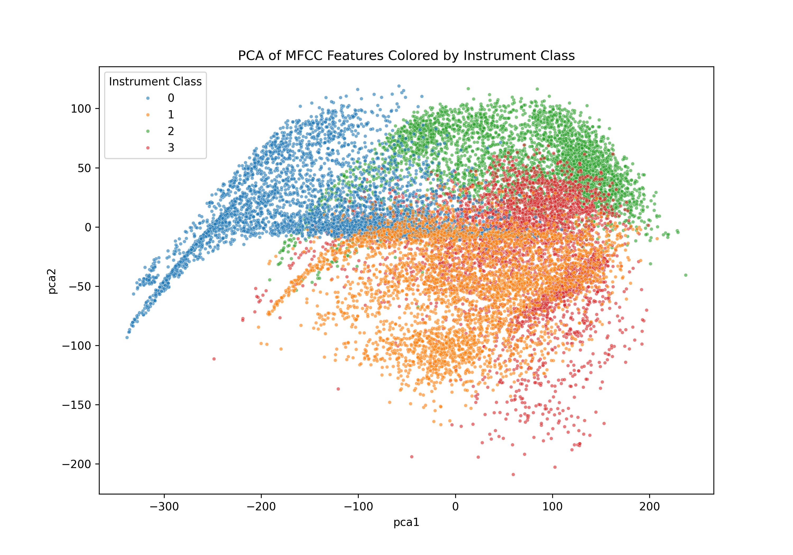
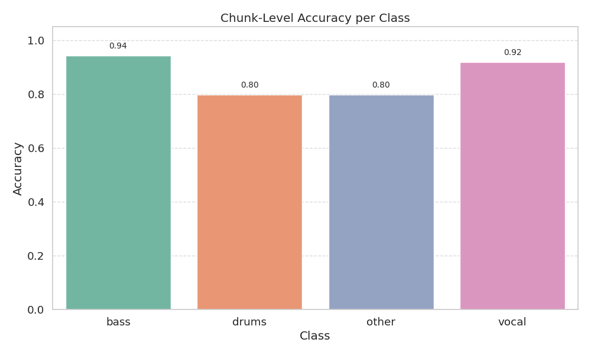
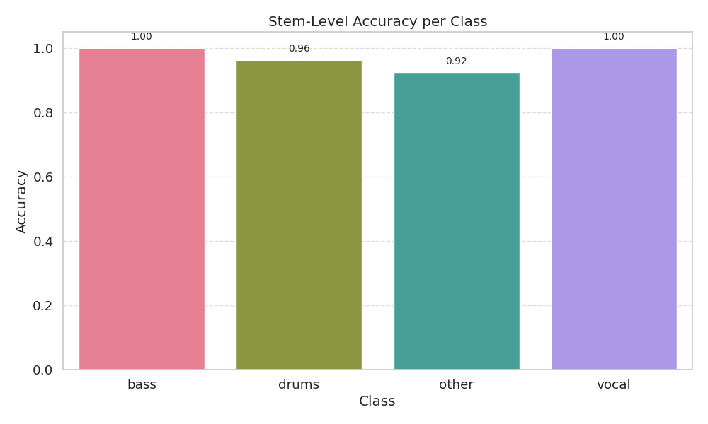
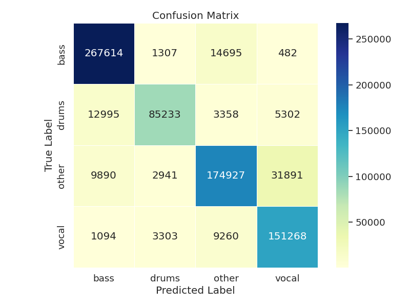

# Ontranet: About The Model
### An Onset Based Model
Stem classification is an interesting problem because it requires us to examine the assumptions made about what _defines_ a stem. Here are some initial thoughts that I had in response to the question "what is a stem":

  1. A sound source coming from the same microphone during a recording
  2. A track of audio with distinct timbral continuity
  3. Any audio output resulting from the parameter space of a given acoustic, analog, or digital instrument

If we're trying to classify stems into four categories, the problem simplifies because we can make assumptions about the characteristics of those four sound classes. More specifically, the categories of `voice`, `drums`, and `bass` each consist of very distinct features when split up with respect to their onsets. My hypothesis here in making this model was that with a large enough dataset of stems, the small musical time-scale of a single sound object (note, percussive hit, etc.) contains enough salient information in itself to be able to infer about the class in which the larger stem belongs. We can thus define a very general outline for a ML model as such:

```math
f : \mathcal{X} \rightarrow \mathcal{C}
```

Where $x_{i} \in \mathcal{X}$ are audio splices belonging to the space of audio splices $\mathcal{X}$, and $\mathcal{C}$ is the set of classes $c_{i}$ which could be `voice`, `drums`, `bass`, or `other`. The model acting at the scale of these individual audio splices can be notated like this:

```math
\hat{c}_{i} = f(x_{i})
```

However, the actual classification of the stem can be expressed as the mode, or "majority vote" of each predicted class within the stem. Thus, the final prediction for the stem can be expressed like this:

```math
\hat{c}_{\mathrm{stem}} = \mathrm{arg}\max_{c \in \mathcal{C}}\sum_{i = 1}^{N}\mathbf{I}(f(x_{i}) = \hat{c}_{i})
```

The important assumption here is that _there is enough salient information contained in the homogeneity of onset-based audio splices within a stem to classify it into one of the four categories_.

Lastly, we could train the model on a twin loss, one pertaining to individual splices and the other to stems in our dataset. While this could be cool to play with in the future, I simply decided to train using a cross-entropy loss pertaining just to individual splices.

### Feature Representations

At the level of audio splices $x_{i}$, we could extract a myriad of salient features that are relevant to this problem. [Peeters et al. (2011)](https://brungio.github.io/GP_2011_JASA.pdf) has an incredible overview of the perceptually salient features of timbre, including both local and global features that would result in either a scalar or a vector for each audio splice, as well as the approximate correlation estimated between these features. Something that I would have loved to do is to dive deep into the literature concerning how these features correlate specifically to sounds produced by voice, drum, and bass---especially when it comes to things like harmonic energy and harmonic / spectral deviation. Due to time constraints however, I decided to just use 8 MFCCs and F0. The F0 was unfortunately extracted using Yin rather than something more accurate like CREPE for this training round due to the fact that I ended up running the feature extraction without a GPU.

### Transformers and Attention

At first, I thought that we could maybe get away with just using these features with a non-learning algorithm such as KNN or K-means. After finding the [MUSDB18](https://sigsep.github.io/datasets/musdb.html#musdb18-compressed-stems) dataset which contains stems from 150 master tracks categorized in with the exact same labels, I downloaded it and plotted the distribution of mean features from the splices extracted from stems from two random tracks, reduced in dimensionality to 2 via PCA:

<p align="center">
  
</p>

The plot shows quite a bit of overlap between the four classes. While much of this overlap is a result of the dimensionality reduction, I figured that we could do a better job separating the feature space by leveraging structural invariance across each feature vector's temporal dimension, instead of just relying on mean features. Thus, I decided to use a transformer in order to encode positional relationships across time for each splice's features, since patterns will most certainly arise based on the contour of each of these features across time. The transformer is thus a great way to encode this contour across time using self-attention. After encoding and pooling the features as tokens, the network passes them through a fully-connected classifying layer with four neurons, each representing one of the stem classes.

### Training 

The model was trained for just 10 epochs with a batch size of 16 after the loss plateaued, with fairly standard learning rates (`1e-3`) and the Adam optimizer. It was trained on 125 files from MUSDB18, while 25 were left for testing. As mentioned earlier, I used a simple cross-entropy loss at the scope of splices, but exploring other loss functions would certainly be something I'd do if I had more time. The model along with the dataset of features extracted from MUSDB18 are both available with `git lfs` (see the main [README.md](./README.md))

### Results (MUSDB18)

Before testing with the stems that were given in question 1, I decided to make a test set from the MUSDB18 model. Using 25 of the masters from the dataset (100 stems total), I tested the accuracy of splice classification, stem classification, and generated a confusion matrix for splice classification. Note that splices are called "chunks" in the plot titles:

<p align="center">
  
  
  
</p>

While the model's accuracy in classifying isolated chunks into the four classes ranges between 80% for `drums` and `other` and 90% for `voice`, the majority vote system for classifying actual stems performed incredibly well, resulting in a total accuracy of __97%__ of the stems. One clear area of improvement in the confusion matrix is the false classification of `other` as `voice`, which makes sense as these types of stems most likely have more ambiguous spliced chunks for analysis due to other being a catch-all category.

